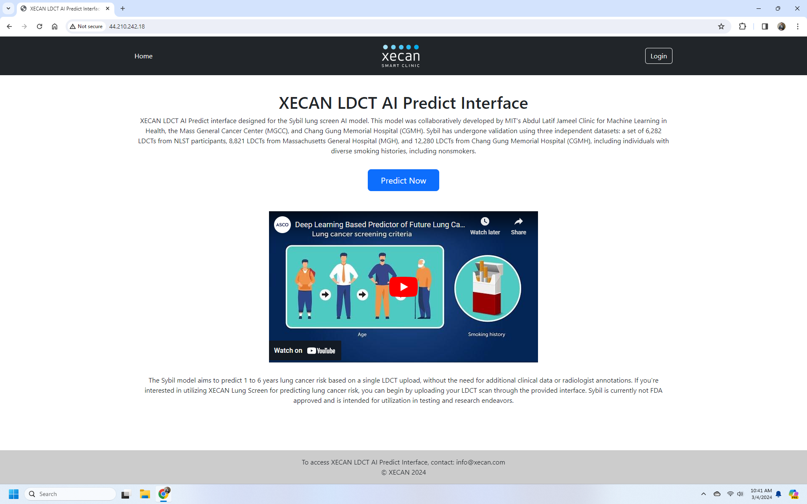

#  XECAN LDCT AI Predict Interface

XECAN LDCT AI Predict interface designed for the Sybil lung screen AI model. This model was collaboratively developed by MIT's Abdul Latif Jameel Clinic for Machine Learning in Health, the Mass General Cancer Center (MGCC), and Chang Gung Memorial Hospital (CGMH). Sybil has undergone validation using three independent datasets: a set of 6,282 LDCTs from NLST participants, 8,821 LDCTs from Massachusetts General Hospital (MGH), and 12,280 LDCTs from Chang Gung Memorial Hospital (CGMH), including individuals with diverse smoking histories, including nonsmokers.

The Sybil model aims to predict 1 to 6 years lung cancer risk based on a single LDCT upload, without the need for additional clinical data or radiologist annotations. If you're interested in utilizing XECAN Lung Screen for predicting lung cancer risk, you can begin by uploading your LDCT scan through the provided interface. Sybil is currently not FDA approved and is intended for utilization in testing and research endeavors.




## Technology Stack
* Python
* Pytorch
* Flask
* SQL
* AWS EC2

## Building Setup
These instruction are to build project in the AWS EC2 Instance.

1.  Install the required tools
    * Python
    * Git
    * Nividia Drivers

    Run the following commands to install the required nvidia drivers

    ```shell
    sudo apt install nvidia-driver-535 nvidia-dkms-535
    ```

    Verify the installation 
     ```shell
    python -V

    git --version

    nvidia-smi
    ```

2. Setting local environment
    ```shell
    sudo apt update

    sudo apt-get install python3.10-venv

    source env/bin/activate
    ```
3. Install Sybil

    Clone the repsitory 
    ```shell
    git clone https://github.com/reginabarzilaygroup/Sybil.git
    ```
    Navigate to the folder
    ```shell
    cd Sybil
    ```
    Open setyp.cfg in editor
    ```shell
    sudo nano setfup.cfg
    ```
    Remove the following pytorch commands 
    ```shell
    torch==1.11.0+cu113; sys_platform != "darwin"
    torch==1.11.0; sys_platform == "darwin"
    torchvision==0.12.0+cu113; sys_platform != "darwin"
    torchvision==0.12.0; sys_platform == "darwin"
    ```
    Press ctrl+O then Press Enter then Press Ctrl+X

    Run the following commands to install the pytorch
    ```shell
    pip install torch==1.11.0+cu113 torchvision==0.12.0+cu113 torchaudio==0.11.0 --extra-index-url https://download.pytorch.org/whl/cu113
    ```  
    Now install sybil 

    ```shell
    pip install .
    ```

    Finally run the following command
    ```shell
    sudo apt-get install libgl1-mesa-glx
    ```
    Verify the installation
    ```shell
    python tests/regression_test.py
    ```
## Depoloying Webinterface 

1. Navigate back to your home directory 
    
    ```shell
    cd ..
    ```
2. Clone this repository 
    ```shell
    git clone https://github.com/xecan/sybli_haris.git
    ```
3. Install the requirements
    ```shell
    pip install -r requirements.txt
    ```
4. Set environment variables 
    ```shell
    source setenv.sh
    ```
5. Navigate to the project
    ```shell
   cd sybli_haris
    ```
6. Install the server
    ```shell
    sudo apt-get install authbind

    sudo touch /stc/authbind/byport/80

    sudo chown ubuntu/etc/authbind/byport/80

    sudo chmod 500 /etc/authbind/byport/80
    ```
7. Run the app
    ```shell
    authbind --deep flask run --host-0.0.0.0 --port=80
    ```
# Contact info@xecan.com for more information 
